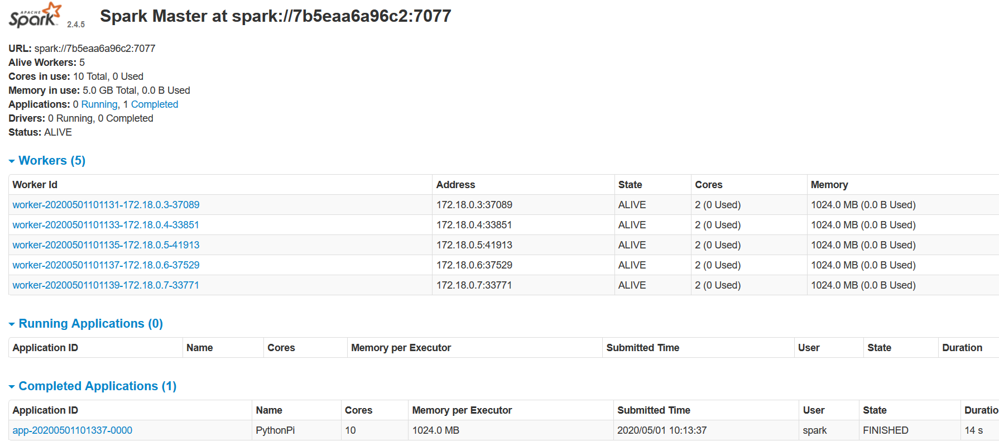

Nama: Raden Bimo Rizki Prayogo

NRP: 0511740000139

# Big Data - Tugas 5

## Percobaan Konfigurasi Spark di Docker

### 2 Workers, 2 Cores

Hasil dengan 100 partisi:

Hasil dengan 1000 partisi:

### 2 Workers, 4 Cores

Hasil dengan 100 partisi:

Hasil dengan 1000 partisi:

### 5 Workers, 2 Cores

Hasil dengan 100 partisi:

Hasil dengan 1000 partisi:

### 5 Workers, 4 Cores

Hasil dengan 100 partisi:

Hasil dengan 1000 partisi:

## Kesimpulan

Partisi harus sesuai dengan kompleksitas pekerjaan. Partisi yang banyak pada task yang simple hanya akan menyebabkan bottleneck, karena spark perlu melakukan distribusi pekerjaan dan penggabungan hasil.

Jumlah partisi harus disesuaikan dengan jumlah worker.